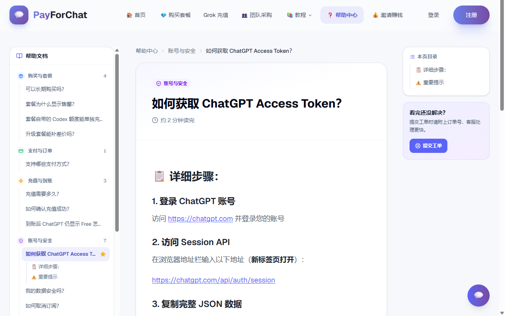

# ChatGPT Plus 国内怎么充值？没海外卡用微信 / 支付宝开通 Plus、Pro、Codex（2026 年 9 月核实）

> 信息最后核实：**2026-09-29**。本仓库由 [PayForChat](https://www.payforchat.com/?utm_source=github&utm_medium=readme&utm_campaign=plus-guide) 团队维护，PayForChat 是独立第三方充值服务，与 OpenAI 没有隶属、代理或授权关系。文中不写人民币价格，价格随汇率和成本调整，以套餐页实时标价为准。

没有海外信用卡、想把 ChatGPT Plus 或 Pro 开到**自己的账号**上：用微信或支付宝付款，付完贴一次临时登录凭证（不是密码），Plus 一般 1–3 分钟到账，充值失败全额退款。

## 快速入口

| 你想做什么 | 直接去 |
|---|---|
| 直接开通 Plus / Pro | [套餐页：看当前在售套餐与价格](https://www.payforchat.com/plans?utm_source=github&utm_medium=readme&utm_campaign=plus-guide) |
| 看一遍完整下单流程再决定 | [ChatGPT Plus 购买完整指南](https://www.payforchat.com/articles/chatgpt-plus-buy-guide-2026?utm_source=github&utm_medium=readme&utm_campaign=plus-guide) |
| 比较官网绑卡、礼品卡、代充哪条路适合你 | [GPT / ChatGPT 代充与充值全指南](https://www.payforchat.com/articles/2026-gpt-chatgpt-recharge-guide-plus-pro?utm_source=github&utm_medium=readme&utm_campaign=plus-guide) |
| 想用 Codex，或 Codex 额度不够 | [Codex 代充指南：套餐、额度、到账](https://www.payforchat.com/articles/codex-recharge-guide-2026?utm_source=github&utm_medium=readme&utm_campaign=plus-guide) |
| 开 Grok（SuperGrok / Super Heavy） | [Grok 充值页](https://www.payforchat.com/grok?utm_source=github&utm_medium=readme&utm_campaign=plus-guide) |
| 已经付款，查进度、提工单、下载 Invoice | [用户中心](https://www.payforchat.com/dashboard) |
| 公司采购、批量开通、报销 | [团队采购](https://www.payforchat.com/team-purchase) |
| 其它问题 | [帮助中心](https://www.payforchat.com/help) |

## 最常问的 8 个问题

| 问题 | 答案 |
|---|---|
| **ChatGPT Plus 国内怎么充值？** | 三步：在套餐页选 Plus 并用微信 / 支付宝付款 → 按页面指引贴一次临时登录凭证 → 系统在你自己的账号上完成官方订阅，邮件通知到账。全程在 payforchat.com 完成，不用加客服微信。 |
| **没有海外信用卡能开 Plus 吗？** | 能。这就是代充解决的问题：你付人民币，平台替你完成官方订阅。也支持 Stripe 国际信用卡付款。 |
| **代充安全吗？会封号吗？** | 充值直接完成在你自己的 ChatGPT 账号上，走正规渠道，账号始终是你的。"代充会封号"的说法几乎都来自共享账号（多人同时登录触发风控）和来路不明的成品账号，PayForChat 不做这两种。 |
| **要交账号密码吗？** | 不要。只用一个有时效的临时访问凭证（浏览器里 `chatgpt.com/api/auth/session` 这一页的内容），充值成功后立即删除。任何要你交密码或验证码的渠道都要警惕。 |
| **多久到账？** | Plus 一般 1–3 分钟自动到账；Pro 5X 以订单页提示为准；Pro 20X 目前只能续费或到期回归，人工处理通常 1–3 小时。2026-09-29 抽查当天 3 笔 Plus 订单，付款到到账 2–4 分钟。 |
| **Plus 没到期能直接升 Pro 吗？** | 不能补差价升级。Pro 充值要求账号处于普通状态，等 Plus 到期后再开 Pro，或用一个干净的新账号开。 |
| **充值失败会退款吗？** | 会，全额原路退款。充值成功后因平台原因导致订阅中断，按已使用天数折算部分退款。 |
| **能开发票吗？** | 已完成订单在用户中心自助下载 PDF Invoice（境外服务消费凭证，和 AWS、GitHub 的一样）。暂不支持国内增值税发票。 |

## 国内开 ChatGPT Plus 的四条路，各适合谁

| 路径 | 前置条件 | 到账 | 2026 年的实际情况 | 适合谁 |
|---|---|---|---|---|
| OpenAI 官网绑卡 | 海外实体卡 + 海外 IP + 对得上的账单地址 | 即时 | 最稳，但国内发行的卡按卡号段直接被拒 | 有海外银行账户的人 |
| App Store 礼品卡内购 | 非国区 Apple ID + 对应区礼品卡 | 配置约半小时 | 礼品卡有 5–10% 溢价，2026 年风控明显收紧；走了内购的账号以后换渠道续费会很麻烦 | 熟悉苹果生态、愿意折腾的 iPhone 用户 |
| 虚拟信用卡 | KYC + USDT 入金 | 不定 | 头部平台 2025 年下半年起陆续停运，卡段被 Stripe 大面积标记，不建议新办 | 只剩存量卡的老用户 |
| **自助代充** | 无 | Plus 1–3 分钟 | 微信 / 支付宝付款，订阅落在自己账号上；关键是挑对平台（见下节） | 没有海外卡、不想折腾的大多数人 |
| 共享账号 / 成品账号 | 无 | 即时 | 对话互相可见、异地同时登录触发风控、随时可能被改密码或找回 | 不建议 |

### 为什么国内卡总是被拒

OpenAI 的收银台走 Stripe，付款时会做三道校验，任何一道不过就 decline：卡号前几位识别出中国大陆发卡行直接拒；支付时的 IP 要落在支持地区且不能是机房 IP；账单地址要和发卡行记录对得上。所以「Your card was declined」「付款未获批准」「Country not supported」是三个不同的问题，换卡解决不了 IP，换节点解决不了卡。细讲见 [ChatGPT 充值失败的原因与解决](https://www.payforchat.com/articles/chatgpt-topup-failed-reasons-solutions-2026)。

## 选代充平台，只看三条

1. **订阅是不是完成在你自己的账号上。** 给你一个"已开好 Plus 的现成账号"的不是代充，是卖号。
2. **要不要密码。** 正规做法只要有时效的临时凭证，用完作废；要密码、要验证码的直接绕开。
3. **售后规则有没有写清楚。** 失败退不退、掉订阅怎么算、订单能不能自己查，写在页面上才算数。

PayForChat 这三条都在页面上：[代充安全吗](https://www.payforchat.com/help/recharge-account-safety) · [售后保障](https://www.payforchat.com/help/after-sales-guarantee) · [服务条款](https://www.payforchat.com/terms)。五家平台的横评见 [2026 年代充平台对比](https://www.payforchat.com/articles/2026-chatgpt-plus-recharge-platforms-comparison)。

## PayForChat 实际流程

### ChatGPT Plus

1. 打开[套餐页](https://www.payforchat.com/plans?utm_source=github&utm_medium=readme&utm_campaign=plus-guide)，选 Plus（有 1 个月、2 个月、3 个月和年卡），微信 / 支付宝 / 信用卡付款。
2. 按订单页指引，在已登录 ChatGPT 的浏览器里打开 `https://chatgpt.com/api/auth/session`，把页面内容整段复制粘贴到订单页。图文步骤见[如何获取 ChatGPT Access Token](https://www.payforchat.com/help/chatgpt-access-token)。
3. 系统自动在你的账号上完成订阅，一般 1–3 分钟，邮件通知结果；订单页每一步都有状态。
4. 到账后登录 chatgpt.com 看套餐页确认。如果仍显示 Free，先刷新、退出再登录、确认登录的是下单时填的邮箱，等 5–10 分钟；超过 30 分钟带订单号提[工单](https://www.payforchat.com/dashboard/tickets)。

### ChatGPT Pro 5X / 20X

- **Pro 5X**：正常可开，流程同 Plus，到账时间以订单页提示为准。要求账号当前没有生效中的 Plus。
- **Pro 20X**：OpenAI 自 2026-09-10 起暂停新购，从没开过 20X 的账号现在开不了。原 20X 订阅可以续费；近期失去 20X 的账号，到期后 30 天内有一次回归机会。这两种情况 PayForChat 人工办理，通常 1–3 小时。你属于哪种、怎么判断，见 [Pro 20X 新购暂停：到期 30 天内可回归一次](https://www.payforchat.com/articles/chatgpt-pro-20x-200-new-subscription-paused-2026)。

### Plus、Pro 5X、Pro 20X 怎么选

| 套餐 | OpenAI 官方价 | 适合谁 | 现在能不能开 |
|---|---|---|---|
| Plus | $20 / 月 | 日常对话、写作、学习，普通强度的 Codex | 能 |
| Pro 5X | $100 / 月 | Plus 额度经常不够、个人高频 Codex、长文档和深度研究 | 能 |
| Pro 20X | $200 / 月 | 全天重度、多项目并行的 Codex 用户 | 仅续费或到期回归 |

5X 和 20X 的 Codex 额度到底差多少、值不值，见 [Pro 5X vs 20X 完整对比](https://www.payforchat.com/articles/chatgpt-pro-5x-vs-20x-comparison)。Codex 用量随 Plus / Pro 套餐附带，不能单独购买额度；Codex 提示"已达到使用上限"怎么办，见[这篇](https://www.payforchat.com/articles/codex-usage-limit-reached-fix-2026)。

## 常见问题

### 我的凭证会被怎么处理？

只用于这一次充值，充值成功后立即删除；敏感数据 AES-256 加密存储，传输全程 HTTPS。这段凭证本身是什么、为什么很多平台要它、安不安全，见 [chatgpt.com/api/auth/session 这串代码是什么](https://www.payforchat.com/articles/chatgpt-access-token-session-json-guide-2026)。

### 到账后 ChatGPT 还显示 Free

多数是页面缓存。刷新或重开 App，退出再登录一次，确认登录的是订单里的邮箱，再等 5–10 分钟。超过 30 分钟仍是 Free，带订单号提工单，不要重复下单。

### 代充会自动续费吗？怎么关？

代充是一次性充值，到期自动停止，不会扣你的钱。如果你之前在官网绑过卡，想关掉官方自动续费：chatgpt.com → 左下角头像 → My plan → Manage my subscription → Cancel plan，当前周期内照常使用。

### 可以给别人的账号充吗？下单后能换账号吗？

可以给任何能登录 chatgpt.com 的账号充，填对应账号的凭证即可。一个订单只对应一个账号，下单后不能换绑，要换请重新下单。

### 之前是 App Store 内购的账号能代充吗？

内购来源的订阅走苹果的账单体系，续费、回归都要在苹果那边操作，代充渠道办不了这类账号的 Pro 20X 续费。Plus 的情况先联系客服确认，别直接下单。

### 充值失败、掉订阅、发票

- 充值失败：全额原路退款，联系客服或提工单即可。
- 充值成功后因平台原因导致订阅中断：按已使用天数折算部分退款。因 OpenAI 政策原因被封禁的情形按[服务条款](https://www.payforchat.com/terms)处理。
- 发票：用户中心 → 我的订单 → 已完成订单 → Invoice，自助生成 PDF，按实付币种开具。已退款订单无法开票；不支持国内增值税发票。

### 联系客服

页面右下角在线客服、[工单](https://www.payforchat.com/dashboard/tickets)，或邮件 support@payforchat.com。

## 核实记录

| 日期 | 核对内容 |
|---|---|
| 2026-09-29 | 套餐页在售：Plus 1 / 2 / 3 个月与年卡、Pro 5X、Grok Super 与 Super Heavy；Pro 20X 仅续费或到期回归。抽查当天 3 笔 Plus 订单，付款到到账 2–4 分钟。支付方式：微信、支付宝、Stripe 信用卡。 |
| 2026-09-20 | OpenAI 补充 Pro 20X「到期 30 天内一次性回归」规则，站内文章同步更新。 |
| 2026-09-10 | OpenAI 暂停 Pro 20X 新订阅，本指南 Pro 部分改为"仅续费或回归"。 |
| 2026-08-25 | 首版发布：四条充值路径对比、Stripe 风控机制说明。 |

发现内容过时、价格或政策变动、报错案例，欢迎提 Issue 或 PR，见 [CONTRIBUTING.md](CONTRIBUTING.md)。

## 延伸阅读

仓库 [docs/](docs/) 里另有 116 篇中文教程，从 AI 基础、ChatGPT 上手到 Codex 进阶，按学习路径排好，和充值无关。站内还有这些和本文直接相关的文章：

- [ChatGPT Plus 代充渠道怎么挑：五个问题问清楚](https://www.payforchat.com/articles/chatgpt-plus-daichong-channel-guide-2026)
- [ChatGPT Plus 续费指南](https://www.payforchat.com/articles/chatgpt-plus-renewal-guide-2026)
- [Plus 和 Pro 的区别](https://www.payforchat.com/articles/chatgpt-plus-vs-pro-comparison)
- [GPT 会员等级全解：Free / Go / Plus / Pro / Business](https://www.payforchat.com/articles/gpt-membership-tiers-guide-2026)
- [Team 和 Plus 的区别](https://www.payforchat.com/articles/chatgpt-team-vs-plus-2026)

## 关于本仓库

- 维护方：PayForChat 团队。PayForChat 是面向国内用户的 ChatGPT / Grok 订阅代充服务，已为 1 万+ 用户完成充值。
- 关联披露：本指南推荐自家服务；路径对比里其他方案的优缺点按实际情况写。发现错误请提 Issue。
- 觉得有用请点个 Star，让更多搜"ChatGPT Plus 怎么充值"的人能看到这一页。
- 协议：[CC BY 4.0](LICENSE)，署名即可转载与改编。
